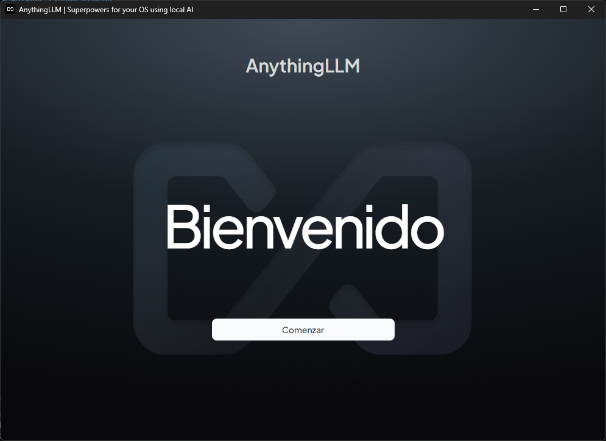
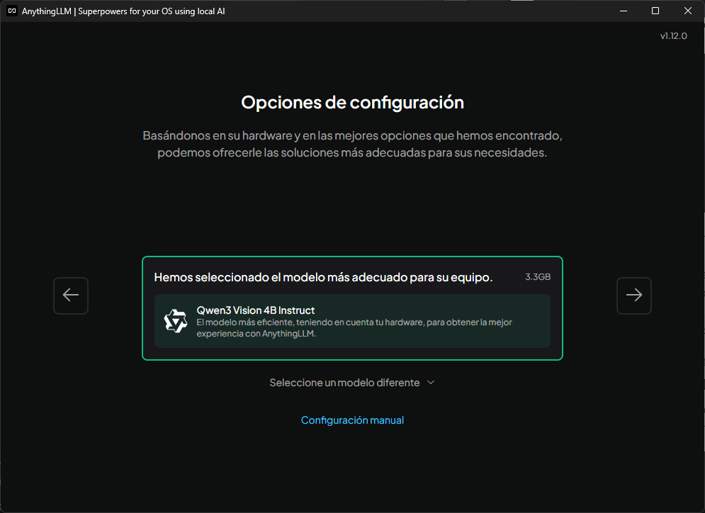
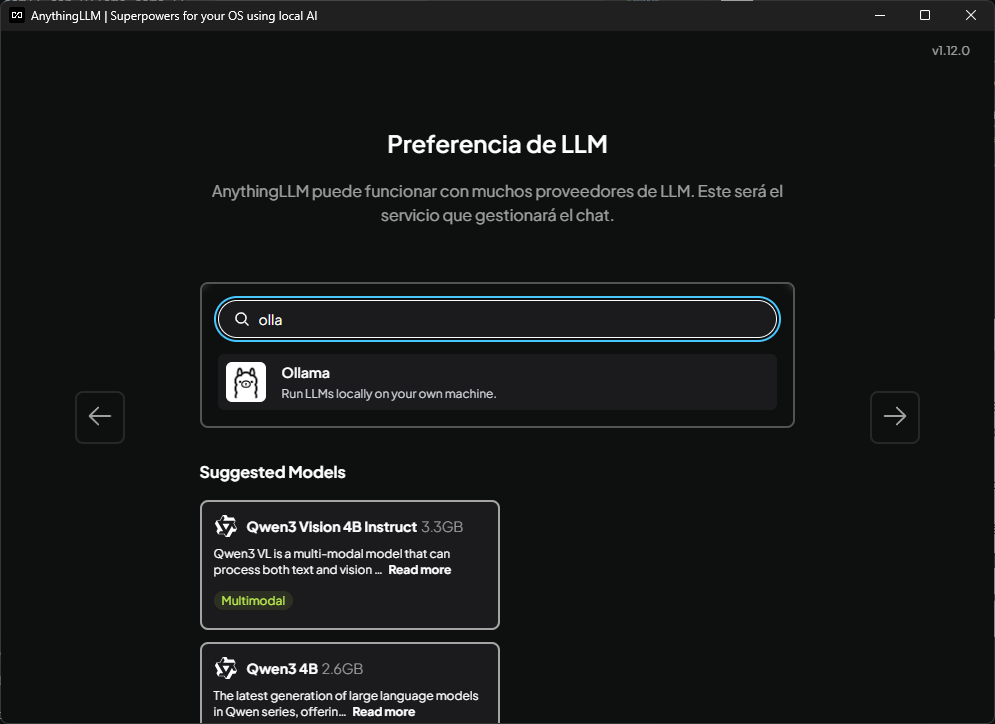
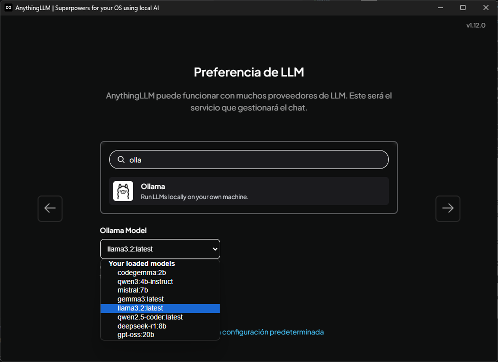
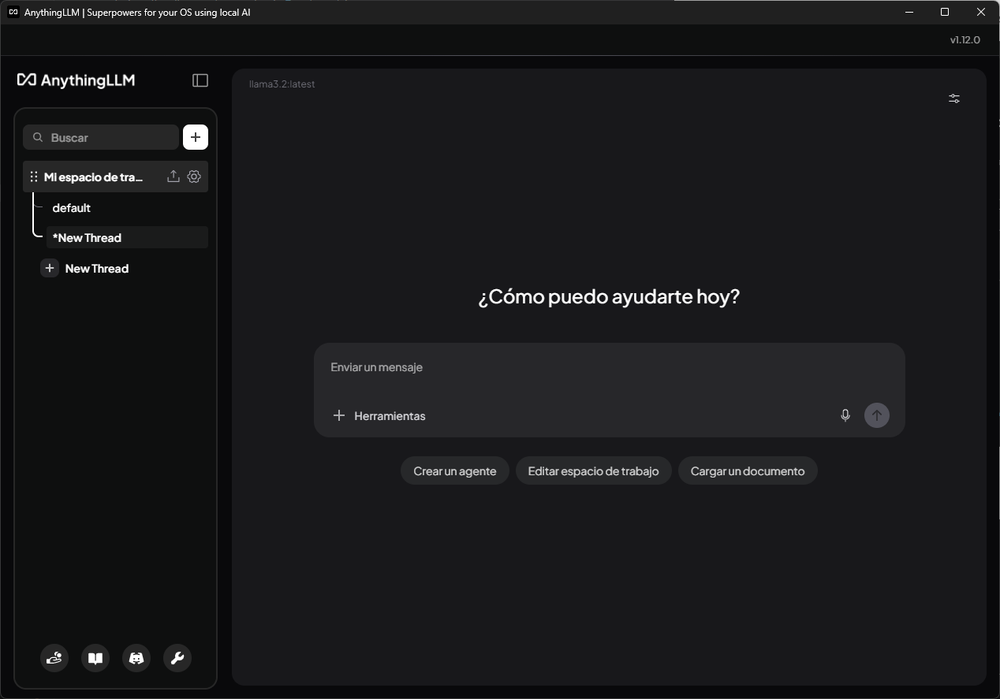
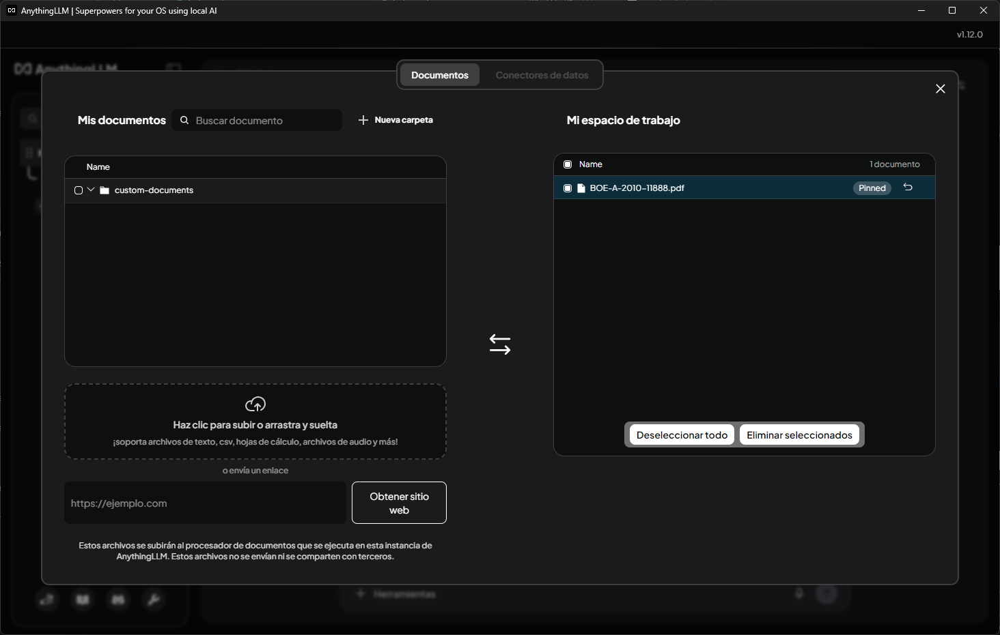
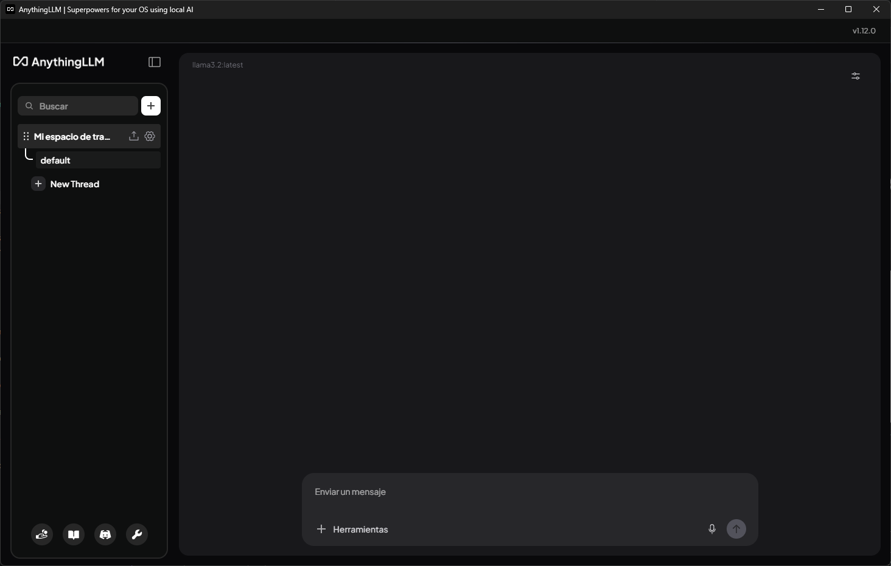

Queremos hacer preguntas a un modelo sobre documentos privados sin enviarlos a servicios externos, y para ello usaremos [AnythingLLM](https://anythingllm.com/) con Ollama como LLM runtime local.

<!-- truncate -->

1. [Instalamos Ollama](/notes/tools/llm-runtimes/ollama/instalacion) y [descargamos el modelo](/notes/tools/llm-runtimes/ollama/modelos#descargar-un-modelo) que queramos usar para analizar los documentos.

2. Instalamos [AnythingLLM](https://anythingllm.com/desktop) y lo ejecutamos.

Si pulsamos "Comenzar", nos sugiere un modelo adecuado a nuestros recursos hardware, pero lo que queremos es usar Ollama como proveedor de modelos.

3. Seleccionamos "Configuración manual" y localizamos "Ollama":

4. Elegimos un modelo de entre los que tenemos disponibles en Ollama y terminamos el proceso de configuración inicial:

5. Creamos un espacio de trabajo (workspace) al que adjuntar documentos y preguntarle a nuestro modelo local:

6. Subimos un PDF al espacio de trabajo y lo pineamos:

7. Y finalmente podemos hacerle preguntas sobre el contenido adjunto al espacio de trabajo:

## Referencias

- [AnythingLLM — Sitio oficial](https://anythingllm.com)
- [AnythingLLM — Documentación](https://docs.anythingllm.com)
- [Notas: AnythingLLM](/notes/tools/llm-runtimes/anythingllm/overview)
