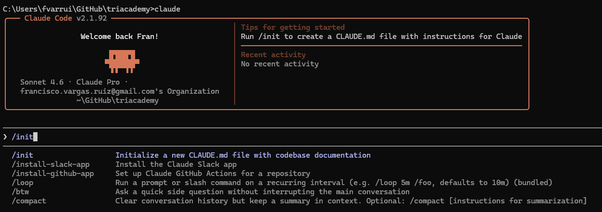
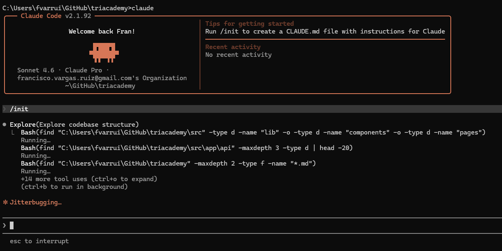
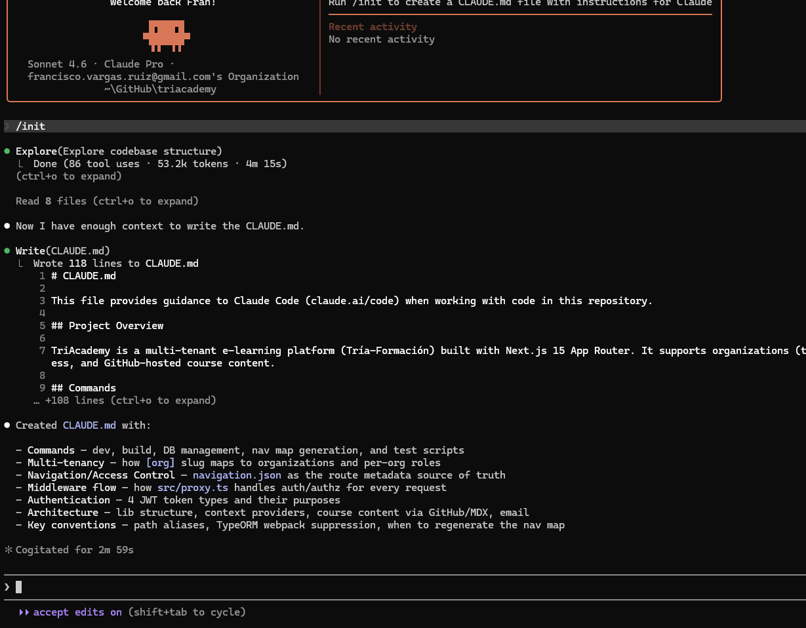

Usar `/init` para que Claude Code analice el proyecto automáticamente y genere un fichero de contexto listo para usar.

<!-- truncate -->

Este **built-in slash command** de Claude Code nos ahorra tiempo analizando el proyecto automáticamente y produciendo un fichero de contexto útil desde el primer momento.

1. Ejecutamos `claude` en nuestro proyecto existente y ejecutamos el comando `/init`:

2. Claude analizará nuestro proyecto para generar el fichero `CLAUDE.md`:

3. Tras la ejecución de `/init`, Claude Code tendrá mayor contexto para trabajar en el proyecto: 

> 🤓 Podemos editar el fichero `CLAUDE.md` generado para añadir restricciones o convenciones específicas de tu proyecto.

## Referencias

- [Configuración de CLAUDE.md](https://docs.anthropic.com/es/docs/claude-code/memory)
- [Notas: CLAUDE.md y directorio .claude](/notes/tools/ai-coding/claude-code/claude-md)
