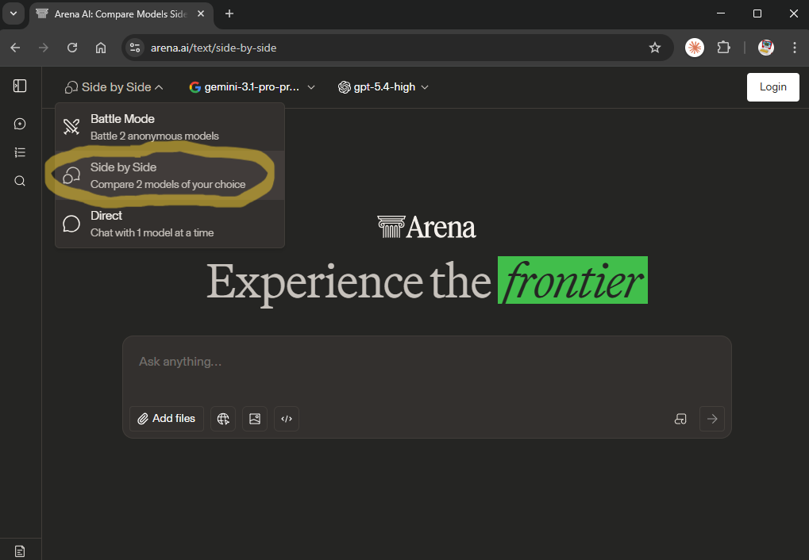
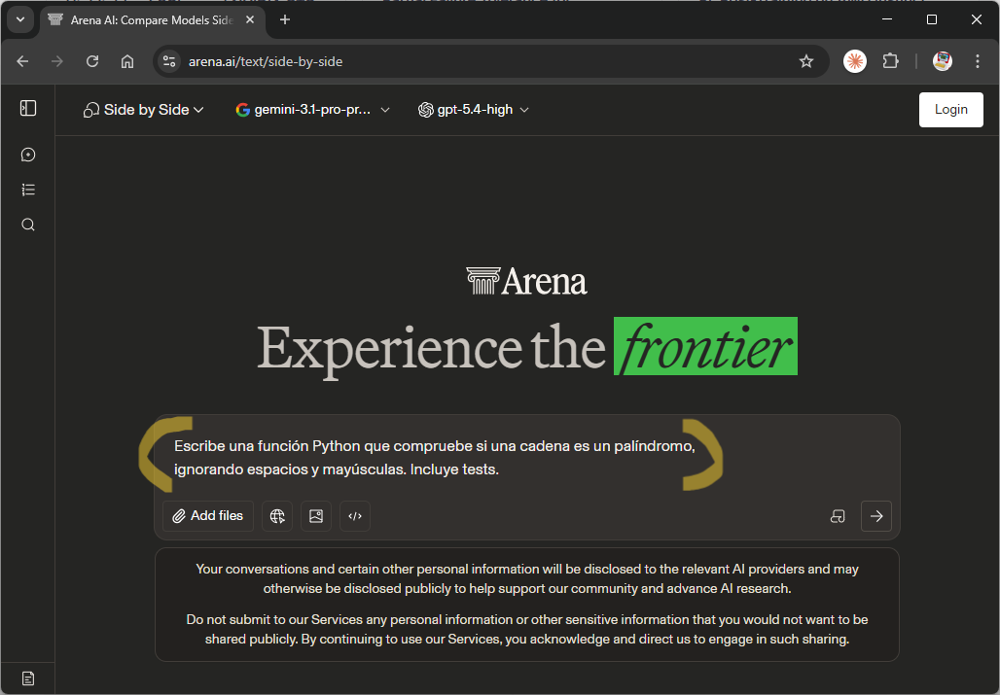
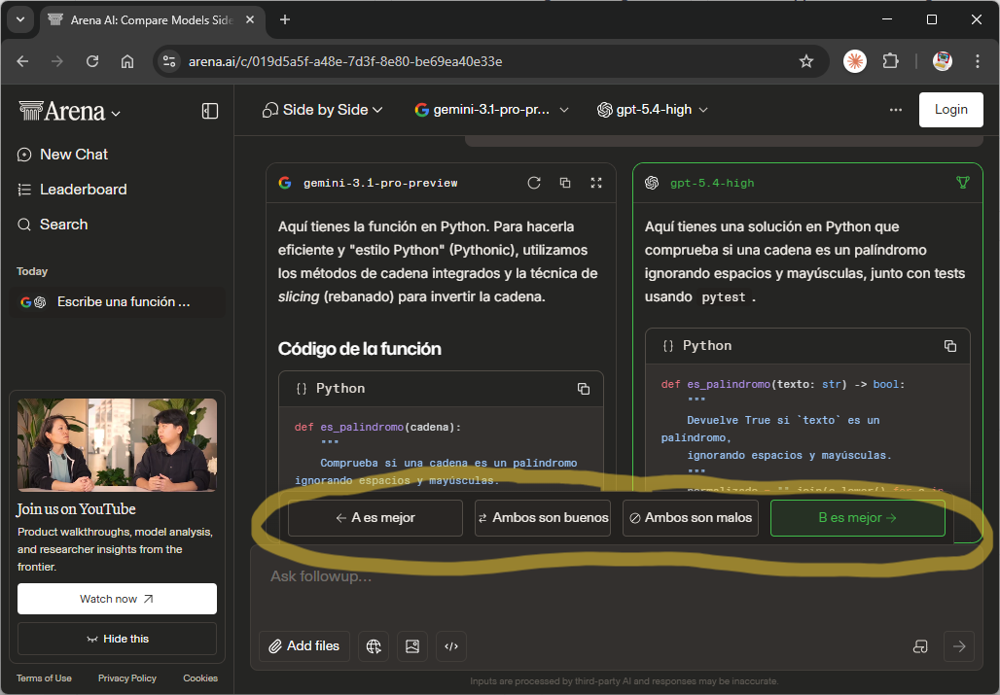
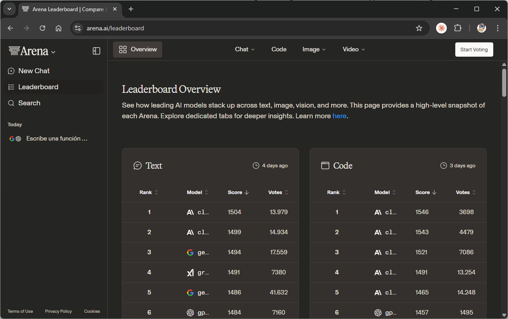

# Comparación de modelos

Con tantos modelos disponibles actualmente se hace difícil elegir el modelo más adecuado para ciertas tareas. 

**Chatbot Arena** es una plataforma de evaluación colaborativa de modelos desarrollada por [LMSYS](https://lmsys.org) que nos permite comparar respuestas de dos modelos y votar la mejor.

<!-- truncate -->

Para comparar dos modelos podemos seguir los siguientes pasos:

1. Accedemos a la web de [**Chatbot Arena**](https://arena.ai/).
2. Elegimos el modo **Side by Side**: Comparar dos modelos de nuestra elección.

> Hay otros dos modos:
>   * **Battle Mode**: Comparar dos modelos aleatorios.
>   * **Direct**: Chatear con un modelo directamente.

3. Le hacemos una consulta.

4. Elegimos qué respuesta consideramos que es la mejor (pueden ser ambas o ninguna).

5. Nuestro voto actualiza el ranking Elo.

## El leaderboard

El resultado acumulado de todos los votos genera un [ranking Elo público](https://arena.ai/leaderboard) que refleja preferencia humana real, no benchmarks de laboratorio. Es la métrica más usada como referencia para comparar la calidad percibida de los modelos frontier.

